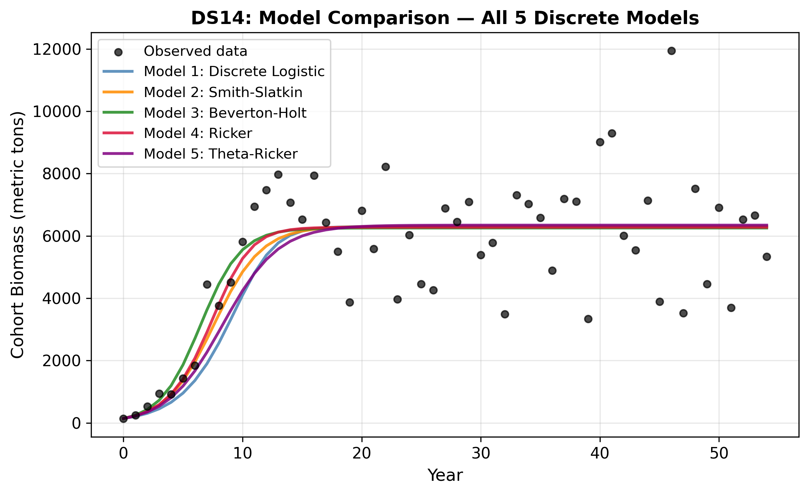
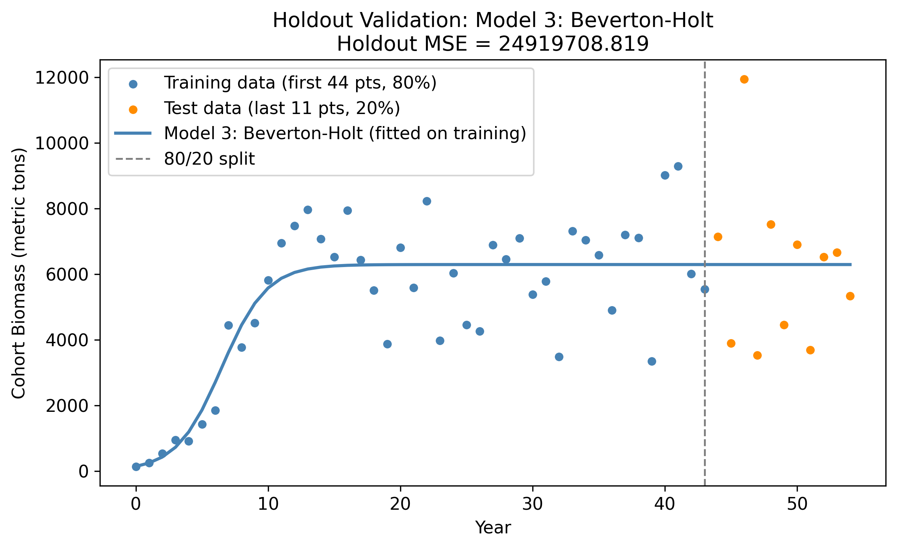
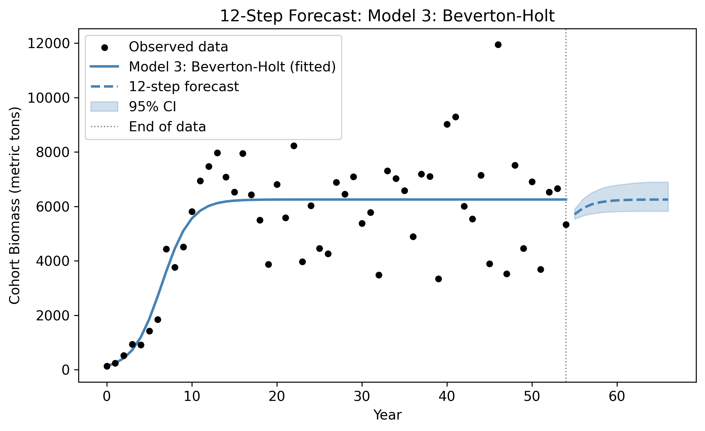

# Dungeness Crab Cohort Biomass Modeling

A mathematical modeling project comparing five discrete population-growth models against a **55-observation Dungeness crab cohort biomass dataset**. The analysis emphasizes model fitting, quantitative model selection, validation, and forecasting rather than assuming a single model in advance.

Developed as part of **MATH 440: Mathematical Modeling** at Christopher Newport University.



## Project Overview

The dataset records cohort biomass from time 0 through 54. I fit and compare five candidate models:

1. Discrete Logistic
2. Smith-Slatkin
3. Beverton-Holt
4. Ricker
5. Theta-Ricker

Parameters are estimated with nonlinear curve fitting. Candidate models are then compared using residual error and **AICc**, followed by additional validation of the top model.

## Analysis Workflow

- Load and inspect the biomass time series
- Fit five candidate population models
- Compare model behavior visually
- Calculate residuals and corrected Akaike Information Criterion (AICc)
- Rank models using AICc and delta-AICc
- Evaluate the selected model on a holdout portion of the data
- Use parameter uncertainty and bootstrap sampling in the forecasting analysis
- Interpret the resulting growth and long-term biomass behavior

## Validation and Forecasting





The project separates model selection from validation so that the final model is evaluated beyond the observations used during fitting. Forecasting is then used to explore how the modeled cohort behaves beyond the observed time range.

## Repository Contents

- `dungeness_crab_biomass_modeling.ipynb` — complete modeling workflow, cleaned of bulky embedded outputs for easier review
- `data/DS14.csv` — project dataset
- `figures/` — raw data, candidate-model comparison, residual, validation, and forecast figures
- `requirements.txt` — Python dependencies

## Tools and Methods

**Python · NumPy · Pandas · SciPy · Matplotlib**

Methods demonstrated include nonlinear parameter estimation, discrete dynamical modeling, residual analysis, AIC/AICc model comparison, holdout validation, uncertainty analysis, and scientific visualization.

## Running the Project

```bash
pip install -r requirements.txt
jupyter notebook dungeness_crab_biomass_modeling.ipynb
```

The notebook reads the included dataset from `data/DS14.csv`.

## Why I Built It

This project strengthened my interest in using applied mathematics and computation to understand biological systems. The same workflow — translating a real system into candidate mathematical models, testing those models against data, and evaluating where they succeed or fail — is a process I hope to carry into graduate work in biomedical engineering and physiological modeling.
